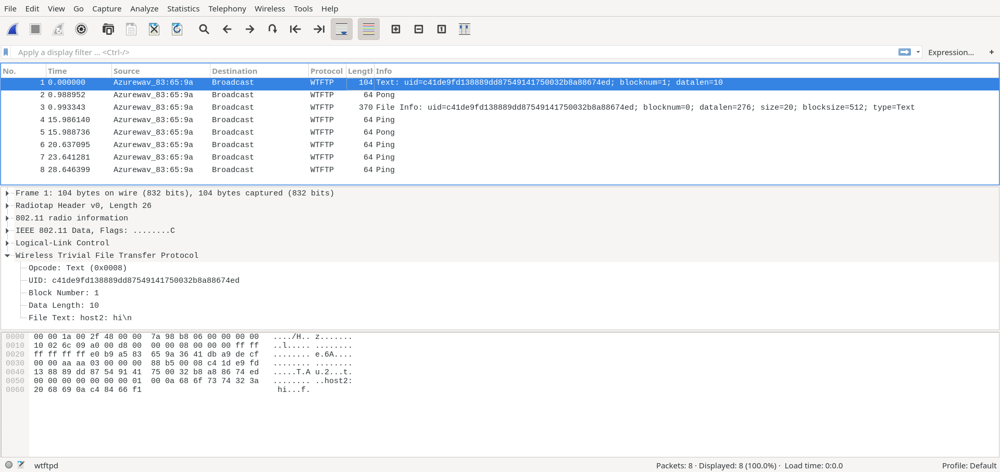

# wtftp
The Wireless Trivial File Transfer Protocol (WTFTP) is a protocol for tranferring files wirelessly by broadcasting packets to all hosts listening in [monitor mode](https://en.wikipedia.org/wiki/Monitor_mode). There is no need to connect to a [wireless access point](https://en.wikipedia.org/wiki/Wireless_access_point).

### Building with make
To build the [wtftp](./lib/wtftp.c) library and [wtftpd](./wtftpd/wtftpd.c) executable first clone this repo and create a build directory:
```shell
git clone https://github.com/jithware/wtftp.git
mkdir ./wtftp.build
cd ./wtftp.build
```

For eclipse development run:
```shell
cmake -G"Eclipse CDT4 - Unix Makefiles" -DCMAKE_ECLIPSE_GENERATE_SOURCE_PROJECT=TRUE -DCMAKE_BUILD_TYPE=Debug ../wtftp
make
```

For a release build run:
```shell
cmake -G"Unix Makefiles" -DCMAKE_BUILD_TYPE=Release ../wtftp
make
```

### Set capabilities on the binary to allow network capture privileges (Linux)
```shell
sudo setcap cap_net_raw,cap_net_admin=eip ./wtftpd/wtftpd
```
If you can not set the capabilities, you will have to execute wtftpd as root or administrator

### Building with meson 
Requires [meson](https://mesonbuild.com/Getting-meson.html) to be installed
```shell
meson build
ninja -C build
```

### Wireless configuration (Unix-like OS)
Configure the wifi adapter manually for monitor mode:
```shell
INTERFACE=wlan0 # set to the 802.11 interface from iwconfig command
sudo ifconfig $INTERFACE down
sudo iwconfig $INTERFACE mode monitor
sudo ifconfig $INTERFACE mtu 2304
sudo ifconfig $INTERFACE up
sudo iwconfig $INTERFACE channel 1
```
If you can not set the wifi adapter to monitor mode, wtftpd will not work. If you compiled wtftpd with wifi configuration support (included wapi), you can run:
```shell
./wtftpd/wtftpd --interface $INTERFACE --monitor --channel 1
```

Or run the shell script:
```shell
./shl/wireless-config.sh wlan0 # set to the 802.11 interface from iwconfig command
```

### Usage
#### Search for hosts
On two diffferent hosts run:
```shell
./wtftpd/wtftpd --interface $INTERFACE --verbose --search 15
```
Each host should 'see' the other. The first MAC address is local host and the second is the remote host.
```
Added host 3a:27:9d:00:00:01
Searching for files in hosts...
Added host e0:b9:a5:00:00:01


Hosts at Tue Dec 03 08:07:31 2019 

e0:b9:a5:00:00:01

3a:27:9d:00:00:01
```

#### Text all listening hosts
On host 1 run:
```shell
./wtftpd/wtftpd --interface $INTERFACE --stdin --prepend host1 --text all
```
On host 2 run:
```shell
./wtftpd/wtftpd --interface $INTERFACE --stdin --prepend host2 --text all
```
On host 1 type:
```shell
hello?
```
On host 2 type:
```shell
hi there!
```
On host 1 you will see:
```shell
hello?
host1: hello?
host2: hi there!
```
On host 2 you will see:
```shell
host1: hello?
hi there!
host2: hi there!
```
You can also stream text. On host 1 run:
```shell
./wtftpd/wtftpd --interface $INTERFACE --stream all
```
On host 2 run:
```shell
echo "Hello World!" | ./wtftpd/wtftpd --interface $INTERFACE --stdin --text all
```
On host 1 you will see:
```shell
Hello World!
```
Hit cntl-c to exit.

#### Get files from a host
On host 1 run:
```shell
mkdir -p /tmp/wtftpd/source 
echo "Hello from host 1!" > /tmp/wtftpd/source/host1.txt
./wtftpd/wtftpd --interface $INTERFACE --source /tmp/wtftpd/source  
```
On host 2 run using the MAC address of host 1 for the get flag:
```shell
mkdir -p /tmp/wtftpd/destination 
./wtftpd/wtftpd --interface $INTERFACE --verbose --search 15
./wtftpd/wtftpd --interface $INTERFACE --destination /tmp/wtftpd/destination --get 5e:6d:f1:00:00:01 --verify --giveup 15 
```
On host 2 you will see:
```shell
Added host e0:b9:a5:00:00:01
Searching for files in hosts...
Added host 5e:6d:f1:00:00:01


Hosts at Tue Dec 03 09:20:27 2019 

5e:6d:f1:00:00:01
  |-- 35:4e:58:c5:72:59:cf:aa:60:07:90:f5:67:2b:9f:64:30:40:0c:39  host1.txt  19  File Data  Tue Dec 03 09:13:29 2019

e0:b9:a5:00:00:01

/tmp/wtftpd/destination/35:4e:58:c5:72:59:cf:aa:60:07:90:f5:67:2b:9f:64:30:40:0c:39 verified!
```
Hit cntl-c to exit.

On host 2 run:
```shell
cat /tmp/wtftpd/destination/host1.txt
```
On host 2 you will see:
```shell
Hello from host 1!
```
You can also stream files. On host 1 run:
```shell
./wtftpd/wtftpd --interface $INTERFACE --stream all > /tmp/wtftpd/all.txt
```
On host 2 run:
```shell
mkdir -p /tmp/wtftpd/source 
echo "Hello from host 2!" > /tmp/wtftpd/source/host2.txt
cat /tmp/wtftpd/source/host2.txt | ./wtftpd/wtftpd --interface $INTERFACE --stdin
```
On host 1 hit cntrl-c and run:
```shell
cat /tmp/wtftpd/all.txt
```
On host 1 you will see:
```shell
Hello from host 2!
```
### Wireshark Usage
First build the wireshark dissector described in [README.md](./plugins/README.md). Run any of the commands above however now add a capture file flag:
```shell
./wtftpd/wtftpd --interface $INTERFACE --stdin --prepend host1 --text all --capfile /tmp/wtftpd/wtftpd.cap
```
After an iteraction between hosts, open the capture file with the custom wireshark build:
```shell
./run/wireshark /tmp/wtftpd/wtftpd.cap 
```
You can review the trace of how the WTFTP transpired with detail packet information. For example see the screenshot below:

